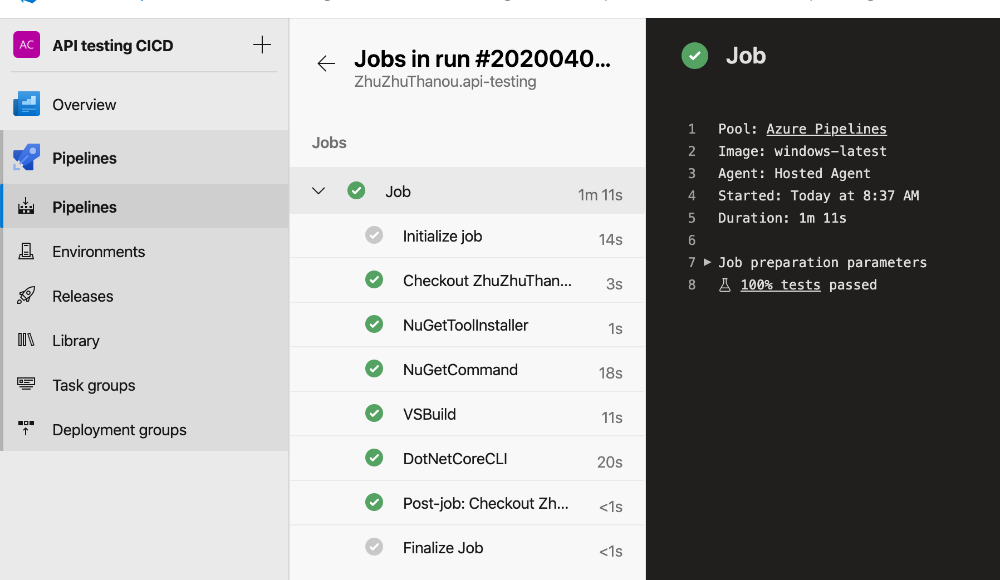

#API-Testing

## Technology
C# • .Net 3.0 • XUnit testing framework
 
## Key classes and file to consider

| Class/File                    | Description                                    | 
|-------------------------------|------------------------------------------------|
| IntegrationTestFixtures.cs    | This file contains shared resources that each test class would use such as HttpClient object. If you have additional reosurces with this charactristic, add them here.|        
| TestEndpoints.cs              | This file contains variables such as URL and API credential information that change depending on environments |
| GreetingTest.cs               | The sample test that references the IntegrationTestFixtures, calls the API and test the output |
| azure-pipelines.yml           | Build and test pipleline as code                |

## Build Pipeline
